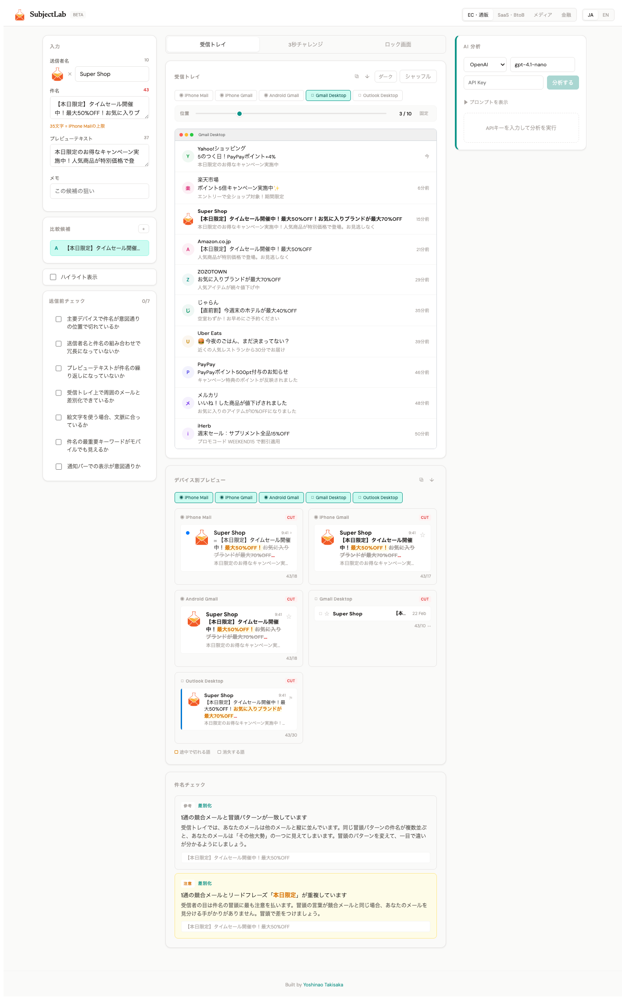

# SubjectLab

**Stop dumping crap into people's inboxes.**

**メールボックスにクソを放り込むな。**

[English](#english) | [日本語](#japanese)

**🔗 [Try it live → ysnotksk.github.io/subject-lab](https://ysnotksk.github.io/subject-lab/)**

<p align="center">
  
</p>

---

<!-- ═══════════════════════════════════════════════════════ -->
<!-- ENGLISH                                                -->
<!-- ═══════════════════════════════════════════════════════ -->

<h2 id="english">English</h2>

## Why this exists

Every email subject line tool on the market does the same thing: score your subject line with a number. "Your score: 72/100. Add more urgency."

The problem is that **nobody opens an email because it scored 72**. People open emails because something caught their eye in a river of 50 other unread messages — in a split second, on a 4-inch screen, sandwiched between an Amazon shipping notification and a Slack digest.

SubjectLab takes a fundamentally different approach. Instead of abstracting your subject line into a score, it puts it back into the visual context where it actually lives: **the inbox**.

---

## Features

| Feature | Description |
|---------|-------------|
| **Inbox Simulator** | Your email mixed into 9 industry-specific competitors with position control |
| **Device Frames** | Inbox simulator wraps emails in realistic iPhone / Android / browser frames |
| **3-Second Challenge** | Timed paradigmatic test: find your email before time runs out |
| **Lock Screen Preview** | Pixel-accurate iPhone and Android notification rendering |
| **Device Previews** | Word-level truncation across 7 clients: iPhone Mail, iPhone Gmail, Android Gmail, Mac Mail, Gmail Desktop, Outlook Desktop (responsive layout switching) |
| **Linguistic Analysis** | Auto-detection of syntagmatic redundancy and paradigmatic similarity |
| **Candidate Comparison** | Test up to 5 subject line variants side by side |
| **Sender Icon Upload** | Upload an avatar image for your sender |
| **Dark Mode** | Inbox simulator dark / light toggle |
| **Image Export** | PNG download or clipboard copy for sharing |
| **AI Analysis** | Optional: OpenAI / Anthropic / Gemini (BYOK) |
| **AI Export** | PNG image or Markdown download of analysis results |
| **Bilingual** | Full Japanese / English, switchable in real time |
| **Pre-send Checklist** | 7 items covering truncation, syntagmatic integrity, and paradigmatic contrast |

---

## Before you A/B test

A/B testing is the gold standard. But it is not free.

Every A/B test consumes a portion of your audience. A test with 2 variants and statistical significance at 95% confidence typically requires thousands of sends — and that's just for one test. If you want to test 5 subject line candidates, you cannot run 5 simultaneous A/B tests. You run 1, maybe 2, with the sends you have. **Every test slot is expensive. The candidates you put into those slots need to be worth testing.**

This is where most email teams get it wrong. They brainstorm 5 subject lines in a meeting, pick 2 that "feel right," and A/B test those. But if both candidates are weak — if both would get buried in the inbox — the A/B test tells you which bad option is less bad. You've spent your test budget learning nothing actionable.

The statistical reality: **A/B testing optimizes the selection from a candidate pool. It does not improve the quality of the pool itself.** If your pool contains one 3% open rate subject line and one 3.2% open rate subject line, the test will (eventually, with enough volume) identify the winner. But a 3.2% winner is still a loss.

SubjectLab exists to improve the pool. Before you commit a candidate to an A/B test — before you spend audience on statistical validation — you can see whether it even survives the inbox. Does it get buried? Does the key phrase get cut off on mobile? Does it look identical to three other emails in the same inbox? These are disqualifying failures that don't need an A/B test to detect. They need a pair of eyes and the right context.

**The workflow this tool enables**: generate candidates → stress-test them visually in SubjectLab → eliminate the weak ones → send the survivors to A/B testing. The result: your A/B test compares your best candidates, not your average ones. The ceiling goes up.

### A/B testing is powerful. That's not an excuse to stop thinking.

Let me be clear: A/B testing is one of the most powerful tools in marketing. I've worked in this field long enough to deeply respect the discipline of letting data drive decisions. That respect is exactly why I'm critical of how casually the term gets thrown around.

"Just A/B test it" has become the default answer to every subject line question. But many of the people saying it don't fully grasp what A/B testing means statistically — the sample sizes required, the confidence intervals, the assumptions that must hold for the result to be valid.

And email A/B testing, specifically, has a problem that rarely gets discussed: **you cannot hold the experimental conditions fixed.** While you're splitting variants, send times drift. Recipients open at different times of day, on different devices, in different contexts. One variant might land at 8am when the inbox is fresh; the other might arrive at 2pm, buried under 30 new messages. The "controlled experiment" is not nearly as controlled as we pretend.

Does this mean A/B testing is useless? Of course not. It means we should be honest about what it can and cannot tell us — and stop using it as a substitute for thinking deeply about what we're sending.

### The inbox is not a static canvas

Here is what gets lost when we reduce email to metrics: **there is a real person on the other side, in a specific moment, in a specific context.**

The same email is a completely different experience depending on when and how it arrives:

- **Late at night** — they're in dark mode, scrolling in bed. Your bright promotional tone feels invasive.
- **During the day** — light mode, scanning quickly between tasks. You have half a second.
- **Business hours** — your email arrives alongside 20 others. It might never be seen at all.
- **First thing in the morning** — you might land at the very top of the inbox. Or you might be the notification that wakes them up and annoys them before their coffee.

No scoring tool accounts for this. No A/B test controls for it. But SubjectLab lets you see some of these contexts — dark mode, device frames, inbox position, lock screen notifications — so you can at least *think* about the person receiving your message before you hit send.

**A/B testing tells you which option wins. It does not tell you whether either option was worth sending.** Craft the message first. Respect the inbox. Then test.

---

## Product philosophy

### Symbol grounding

The deepest problem with scoring-based tools is a problem of *grounding*.

In cognitive science, the "symbol grounding problem" asks: how do abstract symbols acquire meaning? The answer is that symbols must be connected to sensory experience — to the physical world in which they are encountered. A word means nothing until it is encountered in context.

A subject line score — "72 out of 100" — is an ungrounded symbol. It is an abstraction that has been severed from the perceptual context in which the subject line actually functions. The marketer reads the score, but cannot *see* what "72" looks like. Does it mean the email will be opened? Ignored? Lost in a sea of similar promotions? The score cannot answer, because it has no grounding.

SubjectLab's foundational principle is **sensory grounding**: reconnect the subject line to the perceptual environment where it will be judged. Don't tell the marketer their subject line scores 72. *Show them* their email sitting in a crowded inbox, buried between competitors, with the key phrase cut off on mobile. The evaluation becomes grounded — it is no longer abstract, it is felt.

This is not a UX preference. It is an epistemological commitment: **knowledge about a sign's effectiveness can only come from encountering that sign in its native context**.

---

### Cognitive triage

When a notification appears on a phone screen, or when a person scans their inbox, they do not "read" each email. They perform **cognitive triage** — a rapid, largely unconscious sorting process that determines the fate of each message in under a second.

This triage follows a consistent pattern:

```
① WHO is this from?     →  Recognition / Trust filter
② WHAT is this about?   →  Relevance / Urgency filter
③ ACTION: open / skip / defer / delete
```

**Stage 1: Who.** The sender name is processed first. It answers the question "do I know this entity, and do I trust it?" This is a binary gate. If the sender is unknown or untrusted, the subject line may never be read at all. Brand recognition and sender reputation are preconditions, not optimizations.

**Stage 2: What.** If the sender passes the trust filter, the subject line is scanned — not read word-by-word, but scanned for recognizable patterns, keywords, and emotional signals. On mobile, only the first 15-20 characters may be visible. The preview text serves as a secondary signal, extending or clarifying the subject.

**Stage 3: Action.** Based on the combined signal of sender + subject + preview, the recipient makes a snap decision: open now, save for later, archive, or delete. This decision is paradigmatic — it is made *relative to* every other message visible on screen.

SubjectLab is designed to test all three stages: the inbox simulator recreates the paradigmatic field for Stage 3; the device preview tests whether Stage 2 survives truncation; the lock screen preview tests the harshest version of Stage 1+2; and the linguistic analysis checks the syntagmatic integrity of the entire chain.

This model is supported by empirical evidence. Nielsen Norman Group's [eye-tracking studies on email](https://www.nngroup.com/articles/email-newsletters-inbox-congestion/) found that the average time spent on a newsletter after opening is just 51 seconds, and only 19% are fully read — the dominant behavior is scanning, not reading. Their research on [text scanning patterns](https://www.nngroup.com/articles/text-scanning-patterns-eyetracking/) and the [F-shaped reading pattern](https://www.nngroup.com/articles/f-shaped-pattern-reading-web-content-discovered/) further confirms that users process text through rapid visual triage, fixating on the first few words of each line. In an inbox, this means the opening tokens of your subject line carry disproportionate weight.

---

### The linguistics of the inbox

SubjectLab's implementation draws directly from Ferdinand de Saussure's structural linguistics.

**Linearity** — The signifier unfolds in a one-dimensional chain. The device truncates this chain at a physical boundary. SubjectLab tracks not just *how many characters* survive, but *which tokens* — highlighting the exact word where the signifier breaks.

**Syntagmatic relations** — Sender → Subject → Preview form a syntagmatic chain. Each element should advance meaning, not repeat it. SubjectLab auto-detects shared morphemes between sender and subject, and measures lexical overlap between subject and preview.

**Paradigmatic relations** — The inbox is a visible paradigm: a vertical column of substitutable signs. Your email must possess a *trait distinctif*. SubjectLab scans for shared opening patterns, lead phrases, and emoji positions among competing emails.

| Linguistic concept | Implementation | Status |
|---|---|---|
| Linearity | Character + word-level truncation across 7 environments | ✅ |
| Key signifier position | Broken token highlighted in amber, lost tokens in strikethrough | ✅ |
| Syntagmatic chain | Sender → Subject → Preview as unified sequence | ✅ |
| Syntagmatic redundancy | Auto-detect shared morphemes + lexical overlap | ✅ |
| Paradigmatic contrast | Inbox Simulator with industry competitors | ✅ |
| Paradigmatic test | 3-Second Challenge: timed findability | ✅ |
| Paradigmatic similarity | Auto-scan for shared patterns among competitors | ✅ |

---

### Beyond the inbox: notifications

Email marketing has historically optimized for the inbox. But the inbox is no longer the first place recipients encounter your message.

Over 60% of email engagement begins at the **lock screen notification**. The same is true across push notifications, messaging apps, and every other channel that surfaces on a smartphone's lock screen. The lock screen is the most competitive real estate in digital communication: your email competes not only against other emails, but against Slack messages, news alerts, delivery updates, and social media notifications — all in a single, scrolling feed.

This has implications beyond email:

- **Subject line design is notification design.** The same cognitive triage (Who → What → Action) governs push notifications, SMS, chat messages, and lock screen banners.
- **Character limits on notifications are harsher.** A mobile inbox shows ~35 characters; a lock screen notification may show 22. The signifier chain is cut even shorter.
- **The trust filter is harder.** On a lock screen, the sender name competes with dozens of app names. Brand recognition must be instantaneous.

SubjectLab's lock screen preview exists because *the inbox is not the beginning of the recipient's journey — the notification is*. Future iterations will extend this thinking to push notification simulation, rich notification formats, and cross-channel notification comparison.

---

### What SubjectLab does NOT address

SubjectLab optimizes what happens *after* your email reaches the inbox. But reaching the inbox is not guaranteed. The most brilliant subject line is meaningless if the email lands in spam or never arrives.

**Deliverability is the foundation.** Before subject line optimization matters, the following must be in place:

- **SPF** (Sender Policy Framework) — Declares which servers are authorized to send email on behalf of your domain.
- **DKIM** (DomainKeys Identified Mail) — Cryptographically signs your emails, allowing receivers to verify they haven't been tampered with in transit.
- **DMARC** (Domain-based Message Authentication, Reporting and Conformance) — Tells receiving servers what to do with messages that fail SPF/DKIM checks, and provides reporting on authentication results.
- **BIMI** (Brand Indicators for Message Identification) — Displays your brand logo next to authenticated emails, increasing visual trust in the inbox. This directly supports Stage 1 of cognitive triage (Who → Trust).

These are not optimizations. They are **prerequisites**. An email that fails authentication may never reach the inbox, no matter how good the subject line is.

**Brand affinity and loyalty are the long game.** SubjectLab tests the immediate visual impact of a subject line — a single moment in a single inbox scan. But whether someone opens your email at all depends on something that cannot be tested in a simulator: their *relationship with your brand*.

Sender reputation, consistent value delivery, respectful frequency, and genuine relevance over time — these build the trust that makes the "Who" filter work in your favor. A/B tests and subject line tools can optimize the margin. Brand trust determines the baseline.

SubjectLab is one tool in a larger system. Use it to sharpen the blade. But remember that the blade only matters if the recipient already trusts the hand that holds it.

---

## What you can experiment with

SubjectLab is not just a tool — it is a testbed for hypotheses about how people process textual signs in constrained visual environments. Here are experiments you can run:

### Signifier survival experiments

- **"Front-loading" test**: Write two versions of the same subject — one with the key message at the beginning, one at the end. Compare their truncation survival across devices. Does front-loading always win, or are there cases where a bracket prefix (【限定】) burns valuable early space?

- **Bracket tax calculation**: Measure exactly how many characters Japanese bracket patterns (【】「」) consume on each device. Is the visual distinction worth the linear cost?

### Syntagmatic chain experiments

- **Redundancy elimination**: Take your current subject line and remove every element that the sender name already communicates. What do you gain in freed-up space? Does the subject feel incomplete, or does it become more compelling?

- **Preview as continuation**: Write preview text that continues the subject line as if it were the second half of a sentence. Compare this against preview text that merely summarizes the email body. Which drives more curiosity?

### Paradigmatic distinctiveness experiments

- **Camouflage test**: Set the position slider to the bottom (9/10) and run the 3-Second Challenge. If you can't find your email even when you *know* it's there, your subject line has a paradigmatic problem.

- **Industry rotation test**: Switch between industries and observe which inbox environments make your email most/least visible. Does a SaaS email that works well in its native inbox also survive in an EC inbox? This reveals how much your visibility depends on the competition.

- **Emoji position test**: Place the same emoji at the beginning, middle, and end of your subject. Run the 3-Second Challenge for each. Where does the emoji create the strongest paradigmatic contrast?

### Cognitive triage experiments

- **Sender name impact**: Use the same subject line with different sender names (brand name vs. personal name vs. department name). Run the 3-Second Challenge for each. How much does Stage 1 (Who) affect Stage 3 (Action)?

- **Lock screen vs. inbox**: Compare the same email in the lock screen preview and the inbox simulator. Does a subject line that works in the inbox fail on the lock screen? This gap reveals the notification optimization opportunity.

---

## Design decisions

Not what was built, but **why it was built this way** — and what was intentionally left out.

### 1 — Simulation over scoring

No scores. No letter grades. The inbox itself is the test. If you can't find your own email in a simulated inbox within 3 seconds, your recipients won't either. This tests the same cognitive process that real recipients go through.

### 2 — Industry context matters

Dummy emails are industry-specific (EC, SaaS, Media, Finance). A SaaS email competes with Slack digests and GitHub alerts, not Amazon sales. Testing against the wrong paradigm gives false confidence.

### 3 — Position control with a slider

Slider defaults to "Auto" (random); dragging it switches to "Locked" mode. Casual randomness for exploration, intentional positioning for stress-testing the worst case.

### 4 — Notification screen as first impression

Lock screen previews (iPhone + Android) included because over 60% of engagement starts from notifications, not the inbox. Harsher character limits, no color coding, competing against every app.

### 5 — AI is optional, not core

All core features work without API keys. AI adds "why" and "what to change," but the philosophy is: **trust your eyes, not a score** — or an algorithm.

### 6 — Desktop only, intentionally

Email marketers write subject lines at their desk. No mobile-responsive layout. Resource allocation decision, not technical limitation.

### 7 — Export as communication tool

PNG export / clipboard copy captures only simulation content, not UI chrome. The shared image looks like a real inbox, not a tool screenshot.

### 8 — Curated realism over generation

Dummy emails use real brand names and realistic patterns. If the simulation feels synthetic, users discount the test. Quantity expansion (12→18 per industry) is planned to reduce repeat probability from 75% to 50%.

---

## Built with Claude

The ideas in this README — the symbol grounding philosophy, the cognitive triage framework, the Saussurean analysis of inbox behavior, the ethical stance on A/B testing, the deliverability prerequisites — are mine. They come from my background in linguistics and my experience in email marketing.

The implementation is [Claude](https://claude.ai)'s.

I used Claude by [Anthropic](https://anthropic.com) as an implementation partner: translating product thinking into working React code, iterating on visual design through critique cycles, reverse-engineering specifications from prototypes, and structuring this README from conversation into document. Claude held the full technical context across a long dialogue — component architecture, design token systems, truncation logic, export pipelines — so I could focus on *what to build and why* rather than *how*.

The division was consistent throughout: I brought the problem framing, the design philosophy, the domain expertise, and the quality judgment. Claude brought the code, the structural organization, and the execution speed.

This is what good human-AI collaboration looks like. Not "AI generated this." Not "I built this alone." A clear division of thought and craft.

→ [claude.ai](https://claude.ai) · [Anthropic](https://anthropic.com)

---

<!-- ═══════════════════════════════════════════════════════ -->
<!-- 日本語                                                  -->
<!-- ═══════════════════════════════════════════════════════ -->

<h2 id="japanese">日本語</h2>

## なぜこのツールを作ったか

メール件名ツールは世の中にたくさんある。そしてそのほぼ全てが同じことをする——件名にスコアを付ける。「72点。もっと緊急性を出しましょう。」

しかし、**72点だからメールを開く人はいない**。人がメールを開くのは、50通の未読メールが並ぶ受信トレイの中で、一瞬で何かが目に留まったからだ。4インチの画面で、Amazonの配送通知とSlackのダイジェストに挟まれた状態で。

SubjectLabは根本的に異なるアプローチを取る。件名をスコアという抽象に変換するのではなく、件名が実際に存在する視覚的文脈——**受信トレイそのもの**——に戻す。

---

## 機能一覧

| 機能 | 説明 |
|------|------|
| **受信トレイシミュレーター** | 業界別の競合メール9通に混ぜて表示。位置制御スライダー付き |
| **デバイスフレーム** | 受信トレイシミュレーターがメールをリアルなiPhone / Android / ブラウザフレームで表示 |
| **3秒チャレンジ** | 範列的テスト：制限時間内に自分のメールを発見 |
| **ロック画面プレビュー** | iPhone/Androidのロック画面通知をピクセル精度で再現 |
| **デバイス別プレビュー** | 7クライアントでの語レベル切り詰め：iPhone Mail、iPhone Gmail、Android Gmail、Mac Mail、Gmail Desktop、Outlook Desktop（レスポンシブレイアウト切替） |
| **言語構造分析** | 連辞的冗長と範列的類似の自動検出 |
| **候補比較** | 最大5件の件名バリエーションを並行テスト |
| **送信者アイコンアップロード** | 送信者のアバター画像をアップロード |
| **ダークモード** | 受信トレイシミュレーターのダーク/ライト切替 |
| **画像エクスポート** | PNGダウンロードまたはクリップボードコピーで共有 |
| **AI分析** | オプション：OpenAI / Anthropic / Gemini（BYOK） |
| **AIエクスポート** | 分析結果のPNG画像またはMarkdownダウンロード |
| **バイリンガル** | 日本語/英語の完全対応、リアルタイム切替 |
| **送信前チェックリスト** | 切り詰め・連辞的整合性・範列的対比をカバーする7項目 |

---

## A/Bテストの前に

A/Bテストはゴールドスタンダードだ。しかし無料ではない。

全てのA/Bテストはオーディエンスの一部を消費する。2バリアントで95%信頼区間の統計的有意性を得るには、通常数千件の送信が必要だ——そしてそれは1回のテストだけの話だ。5件の件名候補をテストしたい場合、5つの同時A/Bテストは実行できない。持っている送信数で1回、多くて2回だ。**テスト枠は高価だ。その枠に入れる候補は、テストする価値がなければならない。**

ここでほとんどのメールチームが間違える。会議で5つの件名をブレストし、「良さそう」な2つを選んでA/Bテストする。しかし両方の候補が弱ければ——両方とも受信トレイで埋もれるなら——A/Bテストは「どちらのダメな選択肢がマシか」を教えるだけだ。テスト予算を使って、実行可能な知見を何も得ていない。

統計的な現実：**A/Bテストは候補プールからの選択を最適化する。プール自体の質は改善しない。** プールに開封率3%の件名と3.2%の件名が入っていれば、テストは（十分なボリュームがあれば、いずれ）勝者を特定する。しかし3.2%の勝者は依然として負けだ。

SubjectLabはプールの質を改善するために存在する。候補をA/Bテストにかける前に——統計的検証にオーディエンスを費やす前に——その候補が受信トレイで生き残れるかどうかを確認できる。埋もれないか？ キーフレーズがモバイルで切れないか？ 同じ受信トレイの他の3通と見分けがつかなくないか？ これらは失格レベルの欠陥であり、A/Bテストで検出する必要はない。必要なのは一組の目と、正しい文脈だ。

**このツールが可能にするワークフロー**：候補を作る → SubjectLabで視覚的にストレステスト → 弱い候補を排除 → 生き残った候補をA/Bテストへ。結果：A/Bテストは平均的な候補ではなく、最良の候補を比較することになる。天井が上がる。

### A/Bテストは強力だ。だからといって、考えるのをやめていい理由にはならない。

はっきり言っておく：A/Bテストはマーケティングにおいて最も強力なツールの一つだ。この分野で長く働いてきたからこそ、データに基づいて意思決定する規律を深く尊敬している。その尊敬があるからこそ、「A/Bテスト」という言葉が軽く使われることに違和感がある。

「とりあえずA/Bテストしとけば」は、件名に関するあらゆる問いへのデフォルトの答えになっている。しかしそう言っている人の多くは、A/Bテストが統計的に何を意味するか——必要なサンプルサイズ、信頼区間、結果が有効であるために成立しなければならない前提——を完全には理解していない。

そしてメールのA/Bテストには、ほとんど議論されない問題がある：**実験条件を固定できない**ということだ。バリアントを分割している間に配信時間がズレる。受信者は異なる時間帯に、異なるデバイスで、異なる文脈でメールを開く。片方のバリアントは受信トレイが新鮮な朝8時に届き、もう片方は30通の新着メールに埋もれた午後2時に届くかもしれない。「対照実験」は、我々が装っているほど対照的ではない。

これはA/Bテストが無意味だということか？ もちろん違う。A/Bテストに何ができて何ができないかについて正直であるべきだということ——そして、送ろうとしているものについて深く考える代わりにA/Bテストを使うのをやめるべきだということだ。

### 受信トレイは静的なキャンバスではない

メールを指標に還元するとき、見失われるものがある：**受け取る側には実在の人間がいて、特定の瞬間に、特定の文脈の中でメールに出会う**ということだ。

同じメールでも、届くタイミングと状況で体験はまるで変わる：

- **深夜** — ダークモードで、ベッドの中でスクロールしている。明るいプロモーショントーンは侵入的に感じる。
- **日中** — ライトモード、タスクの合間に素早くスキャン。猶予は0.5秒。
- **営業時間中** — 他の20通と一緒に届く。一度も見られないかもしれない。
- **朝イチ** — 受信トレイの一番上に来るかもしれない。あるいは、コーヒーの前に起こす通知になって、ただイラつかせるだけかもしれない。

スコアリングツールはこれを考慮しない。A/Bテストはこれを制御しない。しかしSubjectLabは、こうした文脈の一部を可視化する——ダークモード、デバイスフレーム、受信トレイの位置、ロック画面通知——送信ボタンを押す前に、メッセージを受け取る人のことを少なくとも*考える*ことができるように。

**A/Bテストはどちらの選択肢が勝つかを教える。どちらの選択肢も送る価値があったかどうかは教えない。** まず言葉を磨け。受信トレイに敬意を払え。テストはその後だ。

---

## プロダクト哲学

### 記号接地

スコアリングベースのツールの最も深い問題は、*接地*の問題だ。

認知科学において、「記号接地問題（symbol grounding problem）」は問う：抽象的な記号はどのようにして意味を獲得するのか。答えは、記号が感覚的経験——それが遭遇される物理的世界——に接続されなければならないということだ。語は文脈の中で遭遇されるまで何も意味しない。

件名スコア——「100点中72点」——は接地されていない記号だ。件名が実際に機能する知覚的文脈から切断された抽象である。マーケターはスコアを読むが、「72」がどう*見える*かを知ることはできない。メールは開封されるのか？ 無視されるのか？ 類似のプロモーションの海に消えるのか？ スコアは答えられない。接地がないからだ。

SubjectLabの根本原理は**感覚接地**だ：件名を、それが審判される知覚的環境に再接続する。マーケターに件名が72点だと*告げる*のではなく、混み合った受信トレイに座り、競合に埋もれ、モバイルでキーフレーズが切れた自分のメールを*見せる*。評価は接地される——もはや抽象ではなく、体感になる。

これはUXの好みではない。認識論的なコミットメントだ：**記号の有効性に関する知識は、その記号をネイティブな文脈で遭遇することからしか得られない**。

---

### 認知的トリアージ

スマートフォンの画面に通知が現れたとき、あるいは受信トレイをスキャンするとき、人はメールを「読む」のではない。**認知的トリアージ**を行う——各メッセージの運命を1秒以内に決定する、高速で大部分が無意識の選別プロセスだ。

このトリアージは一貫したパターンに従う：

```
① 誰からか？     →  認知・信頼フィルター
② 何についてか？  →  関連性・緊急性フィルター
③ 行動：開く / スキップ / 後回し / 削除
```

**段階1：誰。** 送信者名が最初に処理される。「この存在を知っているか、信頼しているか？」に答える。これはバイナリゲートだ。送信者が未知または不信任なら、件名は読まれない可能性がある。ブランド認知と送信者レピュテーションは最適化ではなく前提条件だ。

**段階2：何。** 送信者が信頼フィルターを通過すると、件名がスキャンされる——一語ずつ読まれるのではなく、認識可能なパターン、キーワード、感情的シグナルをスキャンされる。モバイルでは最初の15〜20文字しか見えない場合がある。プレビューテキストはセカンダリシグナルとして件名を拡張・明確化する。

**段階3：行動。** 送信者＋件名＋プレビューの複合シグナルに基づき、受信者は即断する：今開く、後で見る、アーカイブ、削除。この決定は範列的だ——画面上の他の全てのメッセージに*対して*行われる。

SubjectLabは3段階全てをテストするよう設計されている：受信トレイシミュレーターは段階3の範列的場を再現し、デバイスプレビューは段階2が切り詰めに耐えるかをテストし、ロック画面プレビューは段階1+2の最も過酷なバージョンをテストし、言語構造分析は連鎖全体の連辞的整合性を検査する。

このモデルは実証的なエビデンスに裏付けられている。Nielsen Norman Groupの[メールに関するアイトラッキング研究](https://www.nngroup.com/articles/email-newsletters-inbox-congestion/)によると、ニュースレターを開封後の平均滞在時間はわずか51秒で、完読されるのは19%のみ——支配的な行動は読むことではなくスキャンだ。[テキストスキャニングパターン](https://www.nngroup.com/articles/text-scanning-patterns-eyetracking/)と[F字型読書パターン](https://www.nngroup.com/articles/f-shaped-pattern-reading-web-content-discovered/)に関する研究も、ユーザーが高速な視覚トリアージでテキストを処理し、各行の最初の数語に視線が集中することを確認している。受信トレイにおいては、件名の冒頭トークンが不釣り合いなほど大きな重みを持つことを意味する。

---

### 受信トレイの言語学

SubjectLabの実装はフェルディナン・ド・ソシュールの構造言語学に直接基づいている。

**シニフィアンの線条性** — シニフィアンは一次元の連鎖として展開する。デバイスはこの連鎖を物理的境界で切断する。SubjectLabは「何文字生存するか」だけでなく「どのトークンが」を追跡し、シニフィアンが壊れる正確な語をハイライトする。

**連辞関係** — 送信者名→件名→プレビューは連辞的連鎖を形成する。各要素は意味を前進させるべきで、繰り返すべきではない。SubjectLabは送信者名と件名の共有形態素を自動検出し、件名とプレビューの語彙重複率を計測する。

**範列関係** — 受信トレイは可視的な範列：代替可能な記号の縦の列だ。メールは*弁別的特徴（trait distinctif）*を持たねばならない。SubjectLabは競合メール間の冒頭パターン、リードフレーズ、絵文字位置の共有を走査する。

| 言語学的概念 | 実装 | 状態 |
|---|---|---|
| 線条性 | 7環境にわたる文字・語レベルの切り詰め | ✅ |
| キーシニフィアン位置 | 壊れたトークンをアンバーでハイライト、失われたトークンは取り消し線 | ✅ |
| 連辞的連鎖 | 送信者名→件名→プレビューを統一シーケンスとして扱う | ✅ |
| 連辞的冗長 | 共有形態素＋語彙重複の自動検出 | ✅ |
| 範列的対比 | 業界別競合メールによる受信トレイシミュレーター | ✅ |
| 範列的テスト | 3秒チャレンジ：時間制限付き発見テスト | ✅ |
| 範列的類似 | 競合間の共有パターン自動走査 | ✅ |

---

### 受信トレイの先へ：通知こそ真のファーストスクリーン

メールマーケティングは歴史的に受信トレイのために最適化してきた。しかし受信トレイはもはや、受信者がメッセージに最初に遭遇する場所ではない。

メールエンゲージメントの60%以上は**ロック画面通知**から始まる。プッシュ通知、メッセージングアプリ、スマートフォンのロック画面に表示される全てのチャネルでも同様だ。ロック画面はデジタルコミュニケーションで最も競争の激しい領域だ：メールは他のメールだけでなく、Slackメッセージ、ニュースアラート、配送通知、SNS通知——全てが一つのスクロールフィードの中で競合する。

これはメールを超えた示唆を持つ：

- **件名デザインは通知デザインである。** 同じ認知トリアージ（誰→何→行動）がプッシュ通知、SMS、チャットメッセージ、ロック画面バナーを支配する。
- **通知の文字制限はより厳しい。** モバイル受信トレイは約35文字を表示するが、ロック画面通知は22文字かもしれない。シニフィアン連鎖はさらに短く切られる。
- **信頼フィルターはより厳しい。** ロック画面では送信者名が数十のアプリ名と競合する。ブランド認知は瞬時でなければならない。

SubjectLabのロック画面プレビューが存在するのは、*受信トレイは受信者の旅の始まりではない——通知が始まりだ*からだ。将来のイテレーションでは、この思考をプッシュ通知シミュレーション、リッチ通知フォーマット、クロスチャネル通知比較に拡張する。

---

### SubjectLabが扱わないもの

SubjectLabは、メールが受信トレイに到達した*後に*起きることを最適化する。しかし受信トレイへの到達は保証されていない。最も優れた件名も、メールがスパムに入るか届かなければ無意味だ。

**到達率は基盤である。** 件名の最適化が意味を持つ前に、以下が整備されていなければならない：

- **SPF**（Sender Policy Framework）— ドメインの代わりにメールを送信する権限を持つサーバーを宣言する。
- **DKIM**（DomainKeys Identified Mail）— メールに暗号署名を付与し、転送中に改竄されていないことを受信側が検証できるようにする。
- **DMARC**（Domain-based Message Authentication, Reporting and Conformance）— SPF/DKIMチェックに失敗したメッセージの処理方法を受信サーバーに指示し、認証結果のレポーティングを提供する。
- **BIMI**（Brand Indicators for Message Identification）— 認証されたメールの横にブランドロゴを表示し、受信トレイでの視覚的信頼を高める。これは認知トリアージの段階1（誰→信頼）を直接サポートする。

これらは最適化ではない。**前提条件**だ。認証に失敗するメールは、件名がどれほど良くても受信トレイに届かない可能性がある。

**ブランドアフィニティとロイヤルティは長期戦である。** SubjectLabは件名の即時的な視覚インパクトをテストする——一つの受信トレイスキャンにおける一つの瞬間。しかし、そもそもメールを開くかどうかは、シミュレーターではテストできないものに依存する：*ブランドとの関係性*だ。

送信者レピュテーション、一貫した価値提供、敬意ある送信頻度、そして時間をかけた真の関連性——これらが「誰」フィルターをあなたに有利に機能させる信頼を構築する。A/Bテストや件名ツールはマージンを最適化できる。ブランド信頼がベースラインを決める。

SubjectLabはより大きなシステムの中の一つのツールだ。刃を研ぐために使ってほしい。しかし、刃が意味を持つのは、受信者がすでにその刃を持つ手を信頼している場合だけだ。

---

## 実験できること

SubjectLabは単なるツールではない——制約された視覚環境の中で人がテクスト記号をどう処理するかについての仮説を検証する実験台だ。以下の実験を試すことができる。

### シニフィアン生存実験

- **「前方配置」テスト**：同じ件名を2バージョン作る——キーメッセージを冒頭に置いたものと末尾に置いたもの。デバイス間で切り詰め生存率を比較する。前方配置は常に勝つのか、それとも括弧接頭辞（【限定】）が貴重な冒頭スペースを消費するケースがあるか？

- **括弧コスト計算**：日本語の括弧パターン（【】「」）が各デバイスで正確に何文字消費するかを計測する。視覚的弁別は線条的コストに見合うか？

### 連辞的連鎖の実験

- **冗長排除**：現在の件名から、送信者名が既に伝えている要素を全て削除する。空いたスペースで何を得るか？ 件名は不完全に感じるか、それともより魅力的になるか？

- **プレビューを続きとして**：プレビューテキストを、件名の後半であるかのように続く文として書く。メール本文を要約するだけのプレビューと比較する。どちらがより好奇心を喚起するか？

### 範列的弁別性の実験

- **カモフラージュテスト**：位置スライダーを最下部（9/10）に設定し、3秒チャレンジを実行する。メールがそこにあると*分かっていても*見つけられないなら、件名は範列的な問題を抱えている。

- **業界ローテーションテスト**：業界を切り替え、どの受信トレイ環境で自分のメールが最も目立つか/目立たないかを観察する。SaaS受信トレイでうまく機能するSaaSメールは、EC受信トレイでも生存するか？ これにより、視認性がどの程度競合に依存しているかが明らかになる。

- **絵文字位置テスト**：同じ絵文字を件名の冒頭・中間・末尾に配置し、それぞれで3秒チャレンジを実行する。絵文字が最も強い範列的対比を生む位置はどこか？

### 認知トリアージの実験

- **送信者名の影響**：同じ件名で異なる送信者名（ブランド名 vs. 個人名 vs. 部署名）を使い、それぞれで3秒チャレンジを実行する。段階1（誰）は段階3（行動）にどれほど影響するか？

- **ロック画面 vs. 受信トレイ**：同じメールをロック画面プレビューと受信トレイシミュレーターで比較する。受信トレイでは機能する件名がロック画面では失敗するか？ このギャップが通知最適化の機会を明らかにする。

---

## デザイン判断

何を作ったかではなく、**なぜそう作ったか**——そして何を意図的に作らなかったか。

### 1 — スコアリングより視覚シミュレーション

スコアなし。ランク付けなし。受信トレイそのものがテスト。シミュレートされた受信トレイで自分のメールを3秒以内に見つけられないなら、受信者も見つけられない。実際の受信者の認知プロセスそのものをテストする。

### 2 — 業界コンテキストが重要

ダミーメールは業界別（EC、SaaS、メディア、金融）。SaaSメールの競合はSlackダイジェストやGitHubアラートであり、Amazonセールではない。誤った範列でテストすると偽りの安心感を得る。

### 3 — スライダーによる位置制御

スライダーのデフォルトは「自動」（ランダム）。ドラッグすると「固定」モード。探索にはカジュアルなランダム性、ワーストケースのストレステストには意図的な位置制御。

### 4 — 通知画面がファーストインプレッション

ロック画面プレビュー（iPhone＋Android）を搭載。エンゲージメントの60%以上は受信トレイではなく通知から始まるため。より厳しい文字制限、色分けなし、全アプリとの競合。

### 5 — AIはオプション

全コア機能はAPIキー不要で動作。AIは「なぜ」「何を変えるか」を追加するが、哲学は：**スコアやアルゴリズムではなく、自分の目を信じろ**。

### 6 — デスクトップ専用は意図的

メールマーケターは件名をデスクで書く。モバイルレスポンシブなし。技術的制約ではなくリソース配分の判断。

### 7 — エクスポートはコミュニケーション

PNGエクスポート/クリップボードコピーはシミュレーション内容のみをキャプチャし、UIクロームを含まない。共有される画像はリアルな受信トレイであり、ツールのスクリーンショットではない。

### 8 — 生成よりキュレーションされたリアリズム

ダミーメールは実在のブランド名とリアルなパターンを使用。シミュレーションが合成的に感じられると、ユーザーはテストを割り引く。繰り返し確率を75%→50%に下げるため、各業界12→18通への拡充を計画中。

---

## Claudeと共に

このREADMEにある思想——記号接地の哲学、認知トリアージのフレームワーク、受信トレイ行動のソシュール的分析、A/Bテストに対する倫理的態度、到達率の前提条件——は私のものだ。言語学のバックグラウンドとメールマーケティングの実務経験から来ている。

実装は[Claude](https://claude.ai)による。

[Anthropic](https://anthropic.com)のClaudeを実装パートナーとして使った：プロダクト思考を動作するReactコードに変換し、批評サイクルを通じてビジュアルデザインをイテレーションし、プロトタイプから仕様書をリバースエンジニアリングし、対話からこのREADMEを構造化した。Claudeは長い対話にわたって技術的コンテキストの全体——コンポーネントアーキテクチャ、デザイントークンシステム、切り詰めロジック、エクスポートパイプライン——を保持していたので、私は*何をなぜ作るか*に集中できた。*どう作るか*ではなく。

役割分担は一貫していた：私が問題の構造化、設計哲学、ドメイン専門知識、品質判断を持ち込んだ。Claudeがコード、構造的整理、実行速度を持ち込んだ。

これが良い人間-AIコラボレーションの姿だ。「AIが生成した」ではない。「一人で作った」でもない。思考とクラフトの明確な分担。

→ [claude.ai](https://claude.ai) · [Anthropic](https://anthropic.com)

---

<!-- ═══════════════════════════════════════════════════════ -->
<!-- Shared / 共通                                          -->
<!-- ═══════════════════════════════════════════════════════ -->

## Getting Started / はじめに

```bash
git clone https://github.com/ysnotksk/subject-lab.git
cd subject-lab
npm install
npm run dev
```

Open `http://localhost:5173` — no API keys needed for core features.

APIキー不要でコア機能が動作します。`http://localhost:5173` を開いてください。

> **Live demo vs. local**: The [GitHub Pages version](https://ysnotksk.github.io/subject-lab/) includes all core features but does not include AI analysis. To use AI-powered analysis (OpenAI / Anthropic / Gemini), clone the repo and run locally — bring your own API key.
>
> **ライブデモ vs. ローカル**: [GitHub Pages版](https://ysnotksk.github.io/subject-lab/)は全コア機能を搭載していますが、AI分析は含まれていません。AI分析（OpenAI / Anthropic / Gemini）を使うには、リポジトリをクローンしてローカルで実行してください——APIキーは各自でご用意ください。

---

## Architecture / アーキテクチャ

```
React 18 + Vite 6
├── constants/     — Design tokens, device specs (7 clients), industry email pools, checklists
├── utils/         — Linguistic analysis (tokenizer, syntagmatic/paradigmatic), storage
├── components/
│   ├── common/    — SectionHeader, Card, SmallButton, ExportButtons, DeviceFrame
│   ├── sidebar/   — InputPanel (with icon upload), CandidatesPanel, Checklist
│   └── main/      — InboxSimulator (with device frames + width control),
│                    FindTest, NotificationPreview, DevicePreview,
│                    LinguisticAnalysis, AIPanel (drawer)
└── Dependencies: react, react-dom, html-to-image
```

Modular component architecture. No state management library. No CSS framework. Inline styles with design token constants.

モジュラーコンポーネントアーキテクチャ。状態管理ライブラリなし。CSSフレームワークなし。デザイントークン定数によるインラインスタイル。

---

## Design System / デザインシステム

**Editorial Precision** aesthetic: stone-based neutrals, single teal accent. [DM Sans](https://fonts.google.com/specimen/DM+Sans) (body) + [Newsreader](https://fonts.google.com/specimen/Newsreader) (display). No emoji in chrome. No decorative gradients. Professional tool, not AI demo.

**Editorial Precision**スタイル：ストーン系ニュートラル、ティール単色アクセント。DM Sans（本文）＋Newsreader（見出し）。クロームに絵文字なし。装飾グラデーションなし。プロフェッショナルツール、AIデモではない。

---

## Impact & Support

### Has SubjectLab improved your KPIs?

If SubjectLab helped you improve your email open rates, click-through rates, or notification engagement — **I want to hear about it**. Your results validate the approach and help prioritize what to build next.

SubjectLabがメールの開封率、クリック率、通知エンゲージメントの改善に役立ったなら——**ぜひ教えてください**。あなたの成果がこのアプローチを検証し、次に何を作るかの優先順位付けを助けます。

**Share your results / 成果を共有してください:**

- **GitHub Discussions** — Post in the [Success Stories](https://github.com/ysnotksk/subject-lab/discussions/categories/success-stories) category
- **X (Twitter)** — [@ysnotksk](https://x.com/ysnotksk) or `#SubjectLab`
- **LinkedIn** — [linkedin.com/in/ysnotksk](https://linkedin.com/in/ysnotksk)
- **GitHub** — [github.com/ysnotksk](https://github.com/ysnotksk)

### Support this project / プロジェクトを支援する

SubjectLab is free and open source. If it has delivered value to your business, consider supporting its continued development.

SubjectLabは無料でオープンソースです。ビジネスに価値を提供したなら、継続的な開発の支援を検討してください。

- **Sponsor on GitHub** — [github.com/sponsors/ysnotksk](https://github.com/sponsors/ysnotksk)
- **Contribute code** — Issues and PRs are always welcome

Even a short message — "We used SubjectLab and our open rate went from 18% to 24%" — means more than you think.

「SubjectLabを使って開封率が18%から24%に上がりました」——短いメッセージでも、あなたが思う以上に大きな意味を持ちます。

---

## Contributing / コントリビューション

Issues and PRs welcome. If you're an email marketer with opinions about what realistic inbox competition looks like in your industry, I especially want to hear from you — the quality of the simulation depends on the quality of the dummy email data.

IssueとPRを歓迎します。メールマーケターの方で、自分の業界のリアルな受信トレイ競争がどういうものか意見がある方——特に歓迎します。シミュレーションの品質はダミーメールデータの品質に依存するので。

---

## Roadmap

- [ ] Expand dummy email pools: 12 → 18 per industry (repeat probability 75% → 50%)
- [ ] Embed similar-pattern email pairs in each pool
- [ ] Before/after comparison mode
- [ ] Push notification simulation (beyond email)
- [ ] Cross-channel notification comparison
- [ ] GitHub Pages deployment (AI-free public version)

---

## About

Built by [Yoshinao Takisaka](https://github.com/ysnotksk) — a product-minded marketing engineer exploring the intersection of linguistics, marketing technology, and user experience.

[Yoshinao Takisaka](https://github.com/ysnotksk) が制作。言語学、マーケティングテクノロジー、ユーザー体験の交差点を探求する、プロダクト志向のマーケティングエンジニア。

- [GitHub](https://github.com/ysnotksk)
- [X (Twitter)](https://x.com/ysnotksk)
- [LinkedIn](https://linkedin.com/in/ysnotksk)

I'm open to new opportunities. If you're building something where product thinking, linguistic intelligence, and frontend craft matter — let's connect.

新しい機会を探しています。プロダクト思考、言語学的知性、フロントエンドクラフトが重要なものを作っているなら——ご連絡ください。

---

## License

MIT
